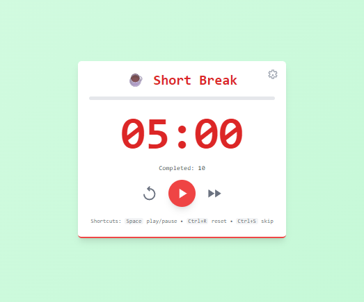
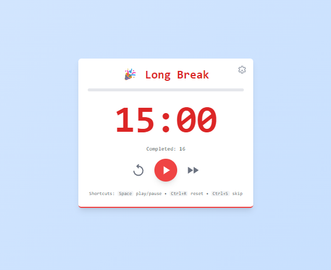
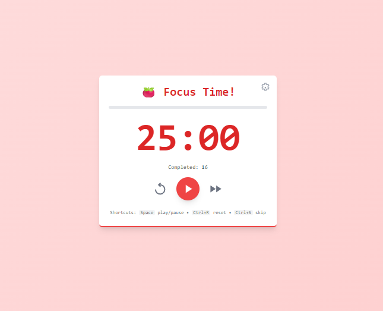

# 🍅 Pomodoro Timer

A full-featured Pomodoro Timer app built with Vanilla JavaScript, HTML, and Tailwind CSS. This app implements the Pomodoro Technique to help improve focus and productivity by breaking work into timed intervals.

## ✨ Features
 
### Core Functionality
- **25-minute work sessions** with 5-minute short breaks
- **15-minute long breaks** after every 4 completed Pomodoros
- **Visual progress bar** showing session progress
- **Session counter** tracking completed Pomodoros
- **Dynamic background colors** for different session types

### User Experience
- **Responsive design** that works on desktop and mobile
- **Keyboard shortcuts** for quick control:
  - `Space` - Play/Pause timer
  - `Ctrl+R` - Reset current session
  - `Ctrl+S` - Skip to next session
  - `Escape` - Close settings modal
- **Visual feedback** with smooth transitions and animations
- **Browser tab updates** showing current time and session type

### Customization
- **Adjustable durations** for work sessions, short breaks, and long breaks
- **Configurable session cycles** (how many work sessions before long break)
- **Auto-start options** for breaks and work sessions
- **Settings persistence** using browser localStorage

### Notifications & Alerts
- **Browser notifications** when sessions complete (with permission)
- **Audio alerts** using Web Audio API for session transitions
- **Visual session indicators** with emojis and colors

## 🚀 Getting Started

### Prerequisites
- Modern web browser with JavaScript enabled
- No additional dependencies required

### Installation & Usage
1. Clone or download this repository
2. Install dependencies and start the development server:
   ```bash
   npm install
   npm start
   ```
3. Open your browser to the provided localhost URL
4. Grant notification permissions when prompted for the best experience

### Controls
1. **Start Timer**: Click the play button or press `Space`
2. **Pause/Resume**: Click pause button or press `Space` again
3. **Reset**: Click reset button or press `Ctrl+R`
4. **Skip Session**: Click skip button or press `Ctrl+S`
5. **Open Settings**: Click the gear icon in the top-right
6. **Customize**: Adjust durations and preferences in settings

## 🎯 The Pomodoro Technique

The Pomodoro Technique is a time management method that uses a timer to break work into intervals:

1. **Work for 25 minutes** (one "Pomodoro")
2. **Take a 5-minute break**
3. **Repeat 3 more times**
4. **Take a longer 15-30 minute break**
5. **Start the cycle again**

This technique helps maintain focus, prevent burnout, and improve productivity.

## 🛠️ Technical Details

- **Framework**: Vanilla JavaScript (ES6+)
- **Styling**: Tailwind CSS via CDN
- **Build Tool**: Vite
- **Storage**: Browser localStorage for settings persistence
- **Notifications**: Web Notifications API
- **Audio**: Web Audio API for sound generation

## 🎨 Customization

The app supports extensive customization through the settings panel:

- **Work Duration**: 1-60 minutes (default: 25)
- **Short Break**: 1-30 minutes (default: 5)
- **Long Break**: 1-60 minutes (default: 15)
- **Sessions Until Long Break**: 2-10 sessions (default: 4)
- **Auto-start**: Toggle automatic session transitions
- **Notifications**: Enable/disable browser notifications
- **Sounds**: Enable/disable audio alerts

## 📱 Browser Support

Works in all modern browsers that support:
- ES6 JavaScript features
- CSS Grid and Flexbox
- Web Audio API (for sounds)
- Web Notifications API (for notifications)
- localStorage (for settings)

---

*A productivity tool implementing the proven Pomodoro Technique for better focus and time management.*
## About Scrimba

At Scrimba our goal is to create the best possible coding school at the cost of a gym membership! 💜
If we succeed with this, it will give anyone who wants to become a software developer a realistic shot at succeeding, regardless of where they live and the size of their wallets 🎉
The Fullstack Developer Path aims to teach you everything you need to become a Junior Developer, or you could take a deep-dive with one of our advanced courses 🚀

- [Our courses](https://scrimba.com/courses)
- [The Frontend Career Path](https://scrimba.com/fullstack-path-c0fullstack)
- [Become a Scrimba Pro member](https://scrimba.com/pricing)

Happy Coding!